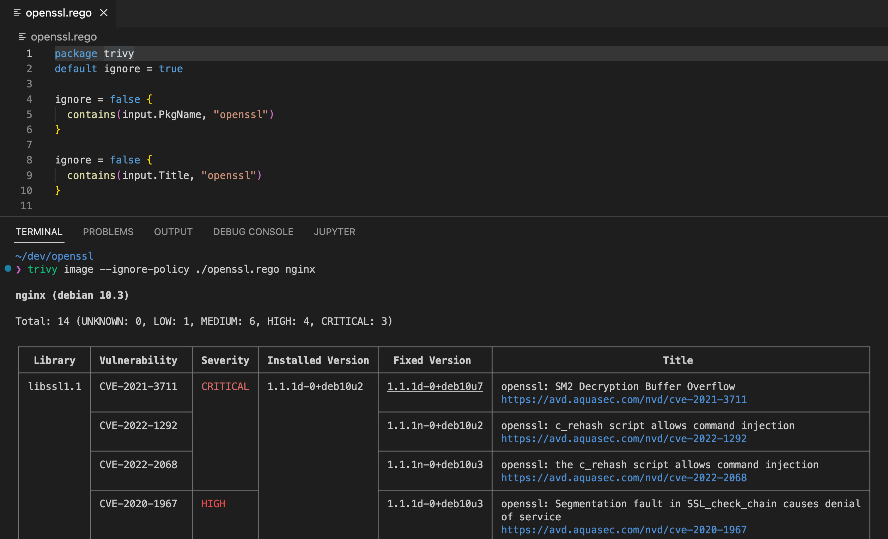
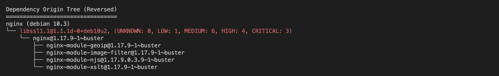
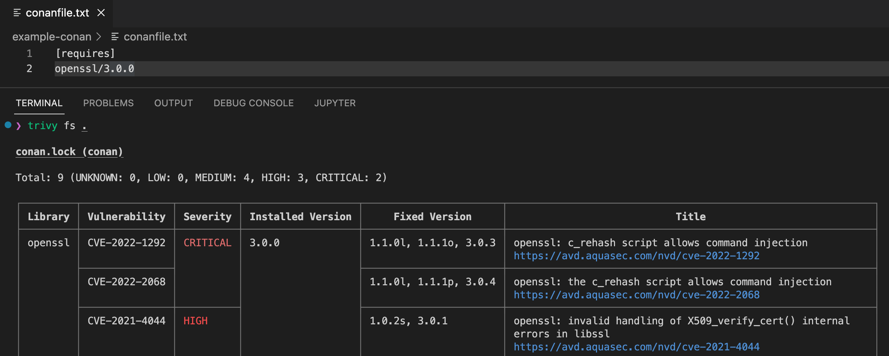
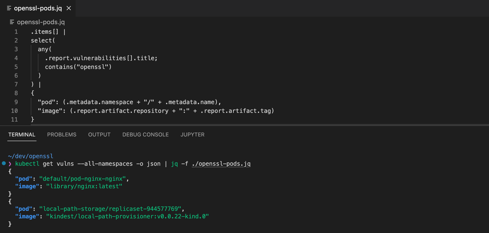

Today, OpenSSL is [set to announce](https://blog.aquasec.com/openssl-vulnerability-2022) a CVE and subsequent patch. This repository provides guidance as to how you can identify and mitigate the vulnerability using [Trivy](https://trivy.dev/) open source security scanner. 

## Package installed via OS package manager

If you have the OpenSSL package installed through your operating system package manager (e.g apt-get, yum, apk, etc), Trivy will detect it.

The following screenshot shows Trivy scanning the nginx container image which has some important OpenSSL related vulnerabilities. The latest OpenSSL vulnerability will be detected and displayed similarly. Note that in order to show only OpenSSL related vulnerabilities, we have used an optional [Trivy filter that is dedicated for this search](openssl.rego).

Now you have found the vulnerable package, but you will also need to find the package that needs to be upgraded. 

The following shows the result of the same Trivy scan, this time with the `--dependency-tree` flag, that detects the vulnerability and traces it to its origin packages. Trivy can reproduce the reverse dependency tree of the vulnerable package, essentially showing you the actual package that should be upgraded. Finding the vulnerable package is not enough, because often it will be a dependency of another application you've installed, for example - `nginx` package might depend on `openssl`, and in order to fix the issue you would need to upgrade `nginx` and not `openssl` directly.

## Package installed via Conan package manager

If your application uses the [Conan](https://conan.io/) package manager for C\C++, Trivy can find the installed packaged through the Conan lockfile.

The following shows Trivy scanning a code repository with OpenSSL 3.0.0 which has some important vulnerabilities. The new OpenSSL vulnerability will be detected and displayed similarly.

## Unpackage binary

Some containers include applications that were installed without a package manager. For example, a Dockerfile that builds and copies the binary to the resulting container image.
When scanning such artifacts, any security scanner will have difficulty identifying the application and its dependencies, but Trivy has an innovative feature that can help.
It is becoming increasingly common for developers to manage and declare their application's dependencies proactively in an software bill of materials (SBOM) and store it in a common directory, such as [Sigstore](https://sigstore.dev). In this case, Trivy will be able to identify the executable binary during the scan and discover its matching SBOM in Sigstore automatically! We have covered this feature in [this blog post]().

## Scanning containers in Kubernetes

Trivy can be installed in Kubernetes using the Trivy Operator Trivy Operator automatically scans all of your workloads and creates Kubernetes-native Custom Resources for informing you of vulnerability reports.

The following shows how you can check for OpenSSL related vulnerabilities across all workloads in cluster by examining the generated Vulnerability Reports. Note that the `jq` utility is used to [filter only OpenSSL instances](openssl-pods.jq), and to construct a report that includes only affected workloads:

